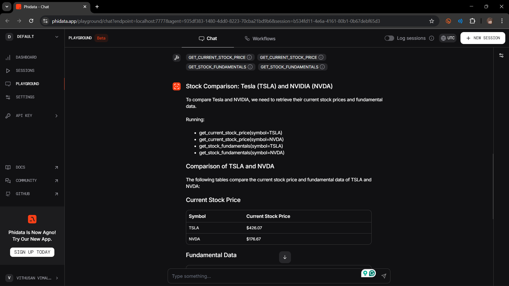

# phidata-financial-agent



Multi-agent demo using phidata with Groq models, DuckDuckGo web search, and YFinance tools. Includes a small Playground UI.

## Requirements

- Python 3.11+
- A Groq API key (`GROQ_API_KEY`)
- Optional: `PHI_API_KEY` if you plan to use any PHI hosted features (not required for local)

## Setup (Windows PowerShell)

Using uv (recommended):

```powershell
uv venv
. .\.venv\Scripts\Activate.ps1
uv pip install -e .
```

Or using pip:

```powershell
py -3.11 -m venv .venv
. .\.venv\Scripts\Activate.ps1
pip install -e .
```

Configure environment variables:

```powershell
Copy-Item .env.example .env
# Edit .env and add your keys (GROQ_API_KEY; optionally PHI_API_KEY)
```

## Run

- Financial agent (CLI):

```powershell
python financial_agent.py
# Optional per-run prompt override
$env:AGENT_PROMPT = "Summarize analyst recommendation and share the latest news for NVDA"; python financial_agent.py
```

- Playground UI:

```powershell
python playground.py
```

## Upload to GitHub

Initialize git (if not already) and push to a new GitHub repo:

```powershell
git init
git add .
git commit -m "Initial commit: phidata financial agent"
# Replace <user>/<repo>.git with your GitHub repository URL
git branch -M main
git remote add origin https://github.com/<user>/<repo>.git
git push -u origin main
```

Notes:
- `.gitignore` already excludes `.env`, venvs, and build artifacts.
- Do NOT commit your `.env` file.

## Project structure

- `financial_agent.py` – Web search and finance agents; prints a response for an NVDA prompt.
- `playground.py` – Starts the phidata Playground with the agents.
- `pyproject.toml` – Dependencies and metadata.
- `.env.example` – Environment variable template.
- `README.md` – This file.